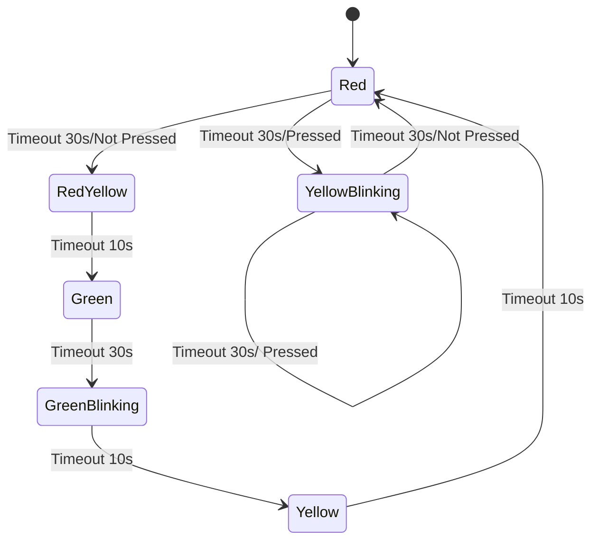

Задача

Використовуючи код із заняття додати стани відповідно до ПДР України.

Станом на 12 січня 2026 року в Україні правила дорожнього руху (ПДР) чітко регламентують послідовність сигналів світлофора для забезпечення безпеки.

Стандартна послідовність перемикання:

Зелений: Дозволяє рух.
Зелений миготливий: Попереджає, що час дії дозволеного сигналу закінчується і скоро буде ввімкнено заборонний сигнал.
Жовтий: Забороняє рух і попереджає про майбутню зміну сигналів.
Червоний: Забороняє рух.
Червоний та жовтий одночасно: Попереджають про наступне ввімкнення зеленого сигналу (рух все ще заборонено).
Зелений: Цикл повторюється.
Особливі випадки:

Жовтий миготливий: Дозволяє рух і інформує про наявність нерегульованого перехрестя або пішохідного переходу.

# State machine
|State\Event|TIMEOUT/SWITCH_REGULATED|TIMEOUT/SWITCH_UNREGULATED|
|-|-|-|
|GREEN|GREEN_BLINKING, timer 10s|-|-|-|
|GREEN_BLINKING|YELLOW, timer 10s|-|-|
|YELLOW|RED, Timer 30s|-|-|
|RED|RED_YELLOW, 10s|YELLOW_BLINKING, 30s|-|-|
|RED_YELLOW|GREEN, 30s|-|-|
|YELLOW_BLINKING|RED, timer 5s|YELLOW_BLINKING, 5s|

